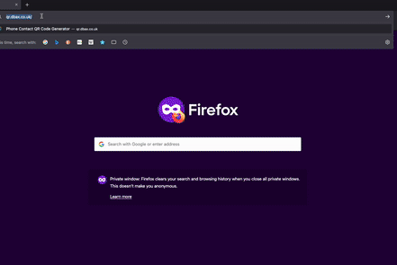

# vCard QR Code Generator

This project generates a customised QR code containing vCard information, with options for custom colours, font selection, and styling.

## Overview



## Features

- Generate QR codes with vCard information
- Customisable QR code and frame colours
- Google Fonts integration for text styling
- Responsive web interface
- Downloadable QR code image
- Social media sharing functionality

## Demo

Visit [QR Code Generator](https://qr.dbax.co.uk/) to see the live app.

## Architecture

Please see the architecture documentation [here](architecture/architecture.md).


## Setup

1. Clone the repository:
   ```
   git clone https://github.com/IliaRyzhkovPR/qr-code-generator
   cd qr-code-generator
   ```

2. Create a new virtual environment:
   ```
   python -m venv myenv
   ```

3. Activate the virtual environment:
   - On Windows:
     ```
     myenv\Scripts\activate
     ```
   - On macOS and Linux:
     ```
     source myenv/bin/activate
     ```

4. Install required packages:
   ```
   pip install -r requirements.txt
   ```

## Usage

1. Run the Flask application:
   ```
   python app.py
   ```

2. Open a web browser and navigate to `http://localhost:5000`.

3. Fill in the form with your contact information, select colors and font, and click "Generate QR Code".

4. The generated QR code will be downloaded automatically.

5. Use the sharing options to share the tool on social media platforms.

## Deployment

This application is deployed on Vercel. Follow these steps to deploy your own instance:

1. Push your code to a GitHub repository.
2. Sign up for a Vercel account if you haven't already.
3. In Vercel, click "New Project" and select your GitHub repository.
4. Vercel will automatically detect it's a Python app. Ensure the following settings:
   - Framework Preset: Other
   - Build Command: `pip install -r requirements.txt`
   - Output Directory: Leave blank
   - Install Command: `pip install -r requirements.txt`
   - Development Command: `python app.py`
5. Add the following environment variable:
   - Key: `PYTHON_VERSION`
   - Value: `3.9` (or your preferred Python version)
6. Click "Deploy" to start the deployment process.

## Customisation Options

- `qr_color`: The colour of the QR code
- `frame_color`: The colour of the frame around the QR code
- `font_name`: The name of the Google Font to use
- `font_size`: The size of the font for the centred text

## Licence

This project is open-source and available under the MIT Licence.

## Contributing

Contributions, issues, and feature requests are welcome! Feel free to check [issues page](https://github.com/IliaRyzhkovPR/qr-code-generator/issues).

## Notes

- The application uses Google Fonts API to fetch fonts. If a font is unavailable, it falls back to a default font.
- The generated QR code includes a frame and rounded corners for improved aesthetics.
- Social media sharing functionality is implemented using respective platform APIs.
- When sharing, use the hashtag #QRCodeGenDBAX to help us track and engage with users.

## Contact

For any queries or support, please contact:
- Email: info@dbax.co.uk
- Website: [https://dbax.co.uk](https://dbax.co.uk)