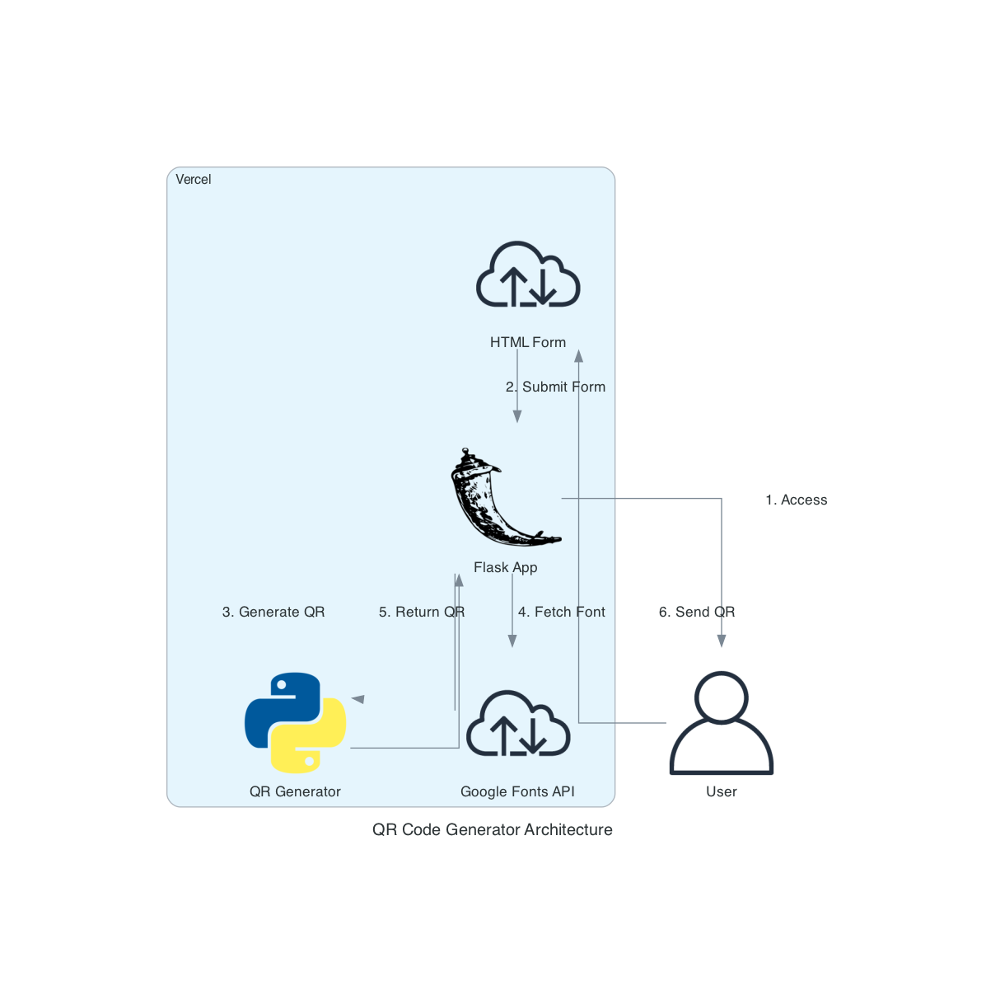

# Updated QR Code Generator Workflow Explanation

The diagram illustrates the flow of data and interactions in the QR Code Generator application, based on the actual implementation in Flask. Here's a step-by-step breakdown:

1. **User Access (User -> HTML Form)**
   The process begins when a user accesses the application through their web browser. They are presented with an HTML form to input their contact information and QR code preferences.

2. **Form Submission (HTML Form -> Flask App)**
   Once the user fills out the form and submits it, the data is sent directly to the Flask application running as a serverless function on Vercel.

3. **QR Code Generation (Flask App -> QR Generator)**
   The Flask app processes the received form data and uses the `qrcode` library to generate a QR code based on the user's specifications. This includes creating a vCard with the provided information.

4. **Font Fetching (Flask App -> Google Fonts API)**
   If a custom font is specified, the application fetches the font from the Google Fonts API. This step is optional and depends on the user's font selection.

5. **QR Code Customization (QR Generator -> Flask App)**
   The generated QR code is further customized within the Flask app. This includes adding a logo (if provided), applying color schemes, and adding frames or rounded corners.

6. **Sending QR Code (Flask App -> User)**
   The final QR code image is sent back to the user's browser as a downloadable file. The user can then save or share this QR code as needed.

This workflow demonstrates a serverless architecture where both the frontend (HTML form) and backend (Flask app) are hosted on Vercel. 

Key Features:
- Serverless deployment on Vercel
- Integration with Google Fonts for custom text styling
- On-the-fly QR code generation without persistent storage
- Custom QR code styling including colors, frames, and logos

This architecture allows for efficient scaling and low-latency responses, as the application runs as a serverless function that spins up on demand.